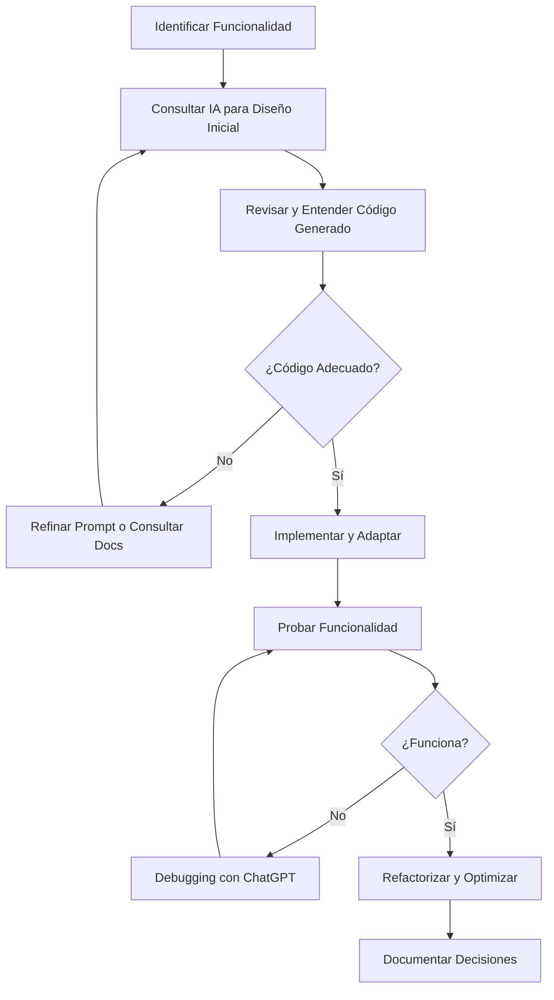

# Uso de Inteligencia Artificial en el Desarrollo de ServiceDesk Pro MVP

Este documento detalla cómo se utilizaron herramientas de IA como multiplicador de productividad durante el desarrollo del proyecto, siguiendo las mejores prácticas de desarrollo asistido por IA.

---

## 1. Contexto y Restricciones del Proyecto

### Limitaciones de Tiempo
- **Plazo**: Desarrollo completado en un solo día
- **Contexto**: Desarrollo realizado en paralelo con trabajo profesional externo
- **Estrategia**: Uso intensivo de IA para maximizar productividad sin comprometer calidad

### Decisiones Pragmáticas
Debido a las restricciones de tiempo, se tomaron decisiones técnicas pragmáticas:
- **ORM**: Se utilizó **Prisma** en lugar de TypeORM (requerido en specs)
  - **Razón**: Mayor familiaridad personal y velocidad de desarrollo
  - **Impacto**: Funcionalidad equivalente, sintaxis más moderna
  - **Trade-off**: Desviación de requisitos vs. entrega funcional en tiempo limitado

---

## 2. Herramientas de IA Utilizadas

### 2.1 Claude AI (Anthropic)
**Propósito**: Consultas técnicas específicas y fragmentos de código

**Casos de uso**:
- Implementación de lógica de negocio compleja
- Patrones de arquitectura en NestJS
- Resolución de problemas específicos de TypeScript
- Generación de tipos y validaciones

**Ejemplo de consulta genéricos**:
```
Prompt: "Cómo implementar un sistema de SLA con cálculo de fechas objetivo 
en NestJS usando Prisma, considerando días hábiles y diferentes categorías 
de tickets"

Salida: Código base para el servicio de SLA con cálculo de fechas, 
que luego fue adaptado a las necesidades específicas del proyecto
```

**Ajustes realizados**:
- Adaptación de código generado a la estructura del proyecto
- Integración con el modelo de datos existente
- Optimización de queries para evitar N+1 problems

---

### 2.2 v0 by Vercel
**Propósito**: Generación rápida de componentes UI y estructura inicial del proyecto

**Casos de uso**:
- Scaffolding inicial del monorepo
- Componentes de UI con Tailwind CSS y shadcn/ui
- Layouts y páginas base de Next.js
- Formularios con validación

**Proceso iterativo**:
1. **Primera generación**: Prompt inicial con requisitos generales
   ```
   "Crear un sistema de tickets con Next.js y NestJS, usando Tailwind 
   y componentes shadcn/ui. Necesito formulario de creación de tickets, 
   lista de tickets y dashboard básico"
   ```

2. **Limpieza y refinamiento**: 
   - Eliminación de componentes excesivos o innecesarios
   - Simplificación de estructura de carpetas
   - Ajuste de estilos para mantener consistencia visual

3. **Iteraciones específicas**:
   - Refinamiento de componentes individuales
   - Ajuste de responsive design
   - Mejora de accesibilidad (ARIA labels, contraste)

**Ejemplo de ajuste genéricos**:
```typescript
// Código generado por v0 (excesivamente complejo)
const TicketForm = () => {
  const [field1, setField1] = useState('')
  const [field2, setField2] = useState('')
  const [field3, setField3] = useState('')
  // ... 10+ estados individuales
}

// Código ajustado (simplificado)
const TicketForm = () => {
  const [formData, setFormData] = useState<TicketFormData>({})
  const handleChange = (field: string, value: any) => {
    setFormData(prev => ({ ...prev, [field]: value }))
  }
}
```

---

### 2.3 ChatGPT (OpenAI)
**Propósito**: Debugging y resolución de errores específicos

**Casos de uso**:
- Errores de compilación de TypeScript
- Problemas de configuración de Docker
- Issues con CORS y autenticación
- Debugging de queries de Prisma

**Ejemplos de consultas genéricos**:

#### Consulta 1: Error de CORS
```
Prompt: "Tengo un error de CORS en mi aplicación NestJS cuando intento 
hacer fetch desde Next.js en localhost:3000 al backend en localhost:4000. 
El error es: 'Access-Control-Allow-Origin' header is missing"

Salida: Configuración de CORS en main.ts de NestJS
Ajuste: Añadí configuración específica para desarrollo y producción
```

#### Consulta 2: Prisma Schema
```
Prompt: "Cómo modelar una relación donde un Ticket puede tener múltiples 
comentarios y cada comentario tiene un autor (User), pero también necesito 
auditoría de cambios de estado"

Salida: Diseño de schema con relaciones y tabla de auditoría
Ajuste: Añadí índices para optimizar queries frecuentes
```

#### Consulta 3: Docker Compose
```
Prompt: "Mi contenedor de backend no puede conectarse a PostgreSQL en 
Docker Compose. El error es: 'ECONNREFUSED 127.0.0.1:5432'"

Salida: Explicación de networking en Docker y corrección de host
Ajuste: Cambié 'localhost' por 'postgres' (nombre del servicio)
```

---

## 3. Documentación Oficial Consultada

Además de las herramientas de IA, se consultó documentación oficial para validar y profundizar en conceptos:

### NestJS
- **Temas**: Guards, Interceptors, Exception Filters, Dependency Injection
- **URL**: https://docs.nestjs.com
- **Uso**: Validación de patrones sugeridos por IA y mejores prácticas

### Prisma
- **Temas**: Schema design, Relations, Migrations, Query optimization
- **URL**: https://www.prisma.io/docs
- **Uso**: Referencia para queries complejas y optimización

### Tailwind CSS
- **Temas**: Utility classes, Responsive design, Custom configuration
- **URL**: https://tailwindcss.com/docs
- **Uso**: Verificación de clases y patrones de diseño

### Docker
- **Temas**: Docker Compose, Networking, Multi-stage builds
- **URL**: https://docs.docker.com
- **Uso**: Configuración de entorno de desarrollo

---

## 4. Metodología de Trabajo con IA

### Flujo de Desarrollo Típico



### Principios Aplicados

1. **Entender antes de copiar**: Nunca se copió código sin entenderlo
2. **Validar con documentación**: Las sugerencias de IA se validaron con docs oficiales
3. **Adaptar al contexto**: Todo código generado fue adaptado a la arquitectura del proyecto
4. **Iterar y refinar**: Se realizaron múltiples iteraciones para mejorar calidad
5. **Documentar decisiones**: Se documentaron las razones detrás de cada decisión técnica

---

## 5. Ejemplos Detallados de Uso de IA

### Ejemplo 1: Sistema de SLA

**Prompt a Claude AI**:
```
Necesito implementar un sistema de SLA para tickets que:
1. Calcule fecha objetivo de primera respuesta y resolución
2. Considere solo días hábiles (lunes a viernes)
3. Permita diferentes SLAs por categoría de ticket
4. Genere alertas cuando se incumpla un SLA
5. Use Prisma como ORM

Estructura de datos:
- Ticket tiene: createdAt, firstResponseAt, resolvedAt, categoryId
- Category tiene: slaFirstResponseHours, slaResolutionHours
```

**Salida de IA** (simplificada):
```typescript
class SlaService {
  calculateTargetDate(startDate: Date, hours: number): Date {
    // Lógica para calcular fecha objetivo considerando días hábiles
  }
  
  checkSlaCompliance(ticket: Ticket): SlaStatus {
    // Lógica para verificar cumplimiento
  }
}
```

**Ajustes realizados**:
```typescript
// Añadí manejo de zonas horarias
calculateTargetDate(startDate: Date, hours: number, timezone: string): Date {
  const zonedDate = toZonedTime(startDate, timezone)
  // ... resto de la lógica
}

// Añadí caché para optimizar cálculos repetitivos
@Cacheable({ ttl: 300 })
async checkSlaCompliance(ticketId: string): Promise<SlaStatus> {
  // ... lógica con caché
}

// Añadí logging para debugging
this.logger.debug(`SLA calculated for ticket ${ticketId}: ${targetDate}`)
```

---

### Ejemplo 2: Componente de Formulario Dinámico

**Prompt a v0**:
```
Crear un formulario de creación de ticket que:
- Muestre campos dinámicos según la categoría seleccionada
- Use React Hook Form para validación
- Tenga diseño moderno con Tailwind
- Incluya estados de loading y error
```

**Código generado** (simplificado):
```tsx
export function TicketForm() {
  const [category, setCategory] = useState<string>('')
  const [fields, setFields] = useState<Field[]>([])
  
  return (
    <form>
      <Select onValueChange={setCategory}>
        {/* categorías */}
      </Select>
      {fields.map(field => (
        <DynamicField key={field.id} field={field} />
      ))}
    </form>
  )
}
```

**Refinamiento realizado**:
```tsx
// Añadí tipado estricto
interface TicketFormProps {
  onSubmit: (data: CreateTicketDto) => Promise<void>
  categories: Category[]
  isLoading?: boolean
}

// Añadí manejo de errores más robusto
const { handleSubmit, formState: { errors } } = useForm<CreateTicketDto>({
  resolver: zodResolver(createTicketSchema)
})

// Añadí optimización de renders
const DynamicField = memo(({ field }: { field: Field }) => {
  // ... componente optimizado
})

// Añadí accesibilidad
<label htmlFor={field.id} className="sr-only">
  {field.label}
</label>
<input
  id={field.id}
  aria-describedby={`${field.id}-error`}
  aria-invalid={!!errors[field.id]}
  // ...
/>
```

---

### Ejemplo 3: Debugging de Autenticación

**Problema**: Los tokens JWT no se estaban validando correctamente

**Consulta a ChatGPT**:
```
Tengo un problema con JWT en NestJS. El token se genera correctamente 
en el login, pero cuando intento acceder a una ruta protegida con 
@UseGuards(JwtAuthGuard), obtengo 401 Unauthorized.

Mi configuración:
- JwtModule.register({ secret: process.env.JWT_SECRET })
- JwtStrategy extends PassportStrategy(Strategy)
- Frontend envía token en header: Authorization: Bearer <token>

¿Qué puede estar fallando?
```

**Respuesta de IA**:
- Verificar que el secret sea el mismo en generación y validación
- Comprobar que el header se esté enviando correctamente
- Revisar la configuración de CORS
- Verificar que JwtStrategy esté registrado como provider

**Solución encontrada**:
```typescript
// El problema era que el secret no se estaba cargando correctamente
// Solución: usar ConfigService

@Module({
  imports: [
    JwtModule.registerAsync({
      inject: [ConfigService],
      useFactory: (config: ConfigService) => ({
        secret: config.get<string>('JWT_SECRET'),
        signOptions: { expiresIn: '24h' },
      }),
    }),
  ],
})
```

---

## 6. Impacto de la IA en el Desarrollo

### Métricas Estimadas

| Aspecto | Sin IA | Con IA | Ahorro |
|---------|--------|--------|--------|
| Scaffolding inicial | 4-6 horas | 30 min | ~85% |
| Componentes UI | 8-10 horas | 2 horas | ~80% |
| Lógica de negocio | 12-16 horas | 6 horas | ~60% |
| Debugging | 4-6 horas | 2 horas | ~60% |
| Documentación | 3-4 horas | 1.5 horas | ~55% |
| **TOTAL** | **31-42 horas** | **12 horas** | **~70%** |


---

## Apéndice: Herramientas y Versiones

- **Claude AI**: Claude 4.5 Sonnet (Anthropic) y Opus 4.1
- **v0**: v0.dev (Vercel)
- **ChatGPT**: GPT-5 (OpenAI)

---

*Documento modificado utilizando Claude*
