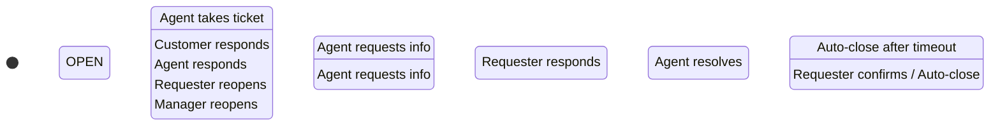

# F2 - Ticket Lifecycle, Permissions and Audit

## Business Context

### Objective
Manage the complete lifecycle of tickets with role-based permissions and comprehensive audit trail.

### Actors
- **Requester**: Views own tickets, adds comments, provides additional information
- **Agent**: Takes tickets, changes status, adds internal/external comments, resolves tickets
- **Manager**: Full access, can reassign, override status, view all audit information

## Technical Specification

### State Machine



### Permission Matrix

| Action | Requester | Agent | Manager |
|--------|-----------|-------|---------|
| View own tickets | ✅ | ✅ | ✅ |
| View all tickets | ❌ | ✅ | ✅ |
| Create ticket | ✅ | ✅ | ✅ |
| Take ticket | ❌ | ✅ | ✅ |
| Change status | ❌ | ✅ | ✅ |
| Add public comment | ✅ | ✅ | ✅ |
| Add internal comment | ❌ | ✅ | ✅ |
| Assign/Reassign | ❌ | ✅ | ✅ |
| Close ticket | ❌ | ✅ | ✅ |
| Reopen closed ticket | ❌ | ❌ | ✅ |
| View audit log | ❌ | ✅ | ✅ |

### API Contracts

#### GET /api/tickets
```typescript
Query: {
  status?: TicketStatus[];
  assignedTo?: string;
  createdBy?: string;
  category?: string;
  page?: number;
  limit?: number;
}

Response: {
  tickets: Ticket[];
  pagination: {
    total: number;
    page: number;
    limit: number;
    totalPages: number;
  };
}
```

#### PATCH /api/tickets/:id
```typescript
Request: {
  status?: TicketStatus;
  agentId?: string;
  priority?: TicketPriority;
}

Response: {
  ticket: Ticket;
  auditLog: AuditLog;
}
```

#### POST /api/tickets/:id/comments
```typescript
Request: {
  content: string;
  isInternal: boolean;
}

Response: {
  comment: Comment;
}
```

### Audit System

#### Tracked Actions
- Ticket creation
- Status changes
- Assignment changes
- Priority changes
- Comments added
- Custom field updates

#### Audit Log Entry
```typescript
interface AuditLog {
  id: string;
  ticketId: string;
  userId: string;
  action: AuditAction;
  description: string;
  oldValue?: any;
  newValue?: any;
  createdAt: Date;
}
```

### Concurrency Handling

#### Optimistic Locking
- Use version field or updatedAt timestamp
- Detect concurrent modifications
- Show conflict resolution UI

#### Implementation
```typescript
// Backend validation
if (ticket.updatedAt !== requestData.lastUpdatedAt) {
  throw new ConflictException('Ticket was modified by another user');
}
```

## Implementation Plan

### Phase 1: State Management
1. Implement ticket status transitions
2. Add permission middleware
3. Create audit logging system
4. Set up optimistic locking

### Phase 2: UI Components
1. Ticket list with filtering
2. Ticket detail view with actions
3. Comment system (public/internal)
4. Status change interface
5. Assignment interface

### Phase 3: Advanced Features
1. Bulk operations
2. Advanced filtering and search
3. Real-time updates (WebSocket)
4. Audit log viewer

### Testing Strategy

#### Test Cases
1. **State Transitions**: Verify all valid/invalid transitions
2. **Permissions**: Test role-based access control
3. **Concurrency**: Simulate concurrent modifications
4. **Audit Trail**: Verify all actions are logged correctly

## Acceptance Criteria

✅ **Lifecycle Management**
- [ ] All status transitions work according to state machine
- [ ] Proper validation of state changes
- [ ] SLA recalculation on status changes

✅ **Permissions**
- [ ] Role-based access control enforced
- [ ] Users can only perform allowed actions
- [ ] Proper error messages for unauthorized actions

✅ **Audit Trail**
- [ ] All significant actions are logged
- [ ] Audit log is searchable and filterable
- [ ] Historical data is preserved

✅ **Concurrency**
- [ ] Concurrent modifications are detected
- [ ] Users are notified of conflicts
- [ ] Data integrity is maintained
